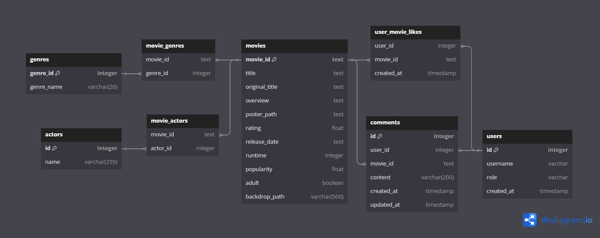

# 🔎 ZnMovie (2023.11.16 ~ 2023.11.24)
    Zoom in Movie

<br>
<br>

# 1. 팀원 정보 및 업무 분담 내역
<br>

## 1 - 1. 차현철 (팀장)
> Back
- accounts 및 movies 앱 관련 코드 작성
- 영화 추천 알고리즘 작성 및 수정
- Django-seed를 통한 더미데이터 생성
- TMDB API를 활용한 fixtures *.json 영화데이터 생성

<br>

> Front
- pinia-plugin-persistedstate 라이브러리를 통한 웹 local-storage 활용
- Django 서버의 Movie 및 Accounts 데이터베이스와 연결 및 데이터 교환
- 데이터베이스 내의 영화 데이터에서 인기도 등 원하는 데이터 출력
- 댓글 CRUD 코드 작성 및 실시간 데이터베이스 반영
- 전반적인 CSS 담당
    - lodash 라이브러리를 활용한 랜덤 배경 출력
    - Typed.js 라이브러리를 활용한 글자 출력
    - Youtube API를 활용한 관련 영상 출력
    - 반응형 웹을 활용한 화면 구성
    - 그 외 웹 페이지 디자인

<br>

## 1 - 2. 이지은 (팀원)
> Back
- Django-rest-auth를 활용한 accounts 관리 및 authorization 설정
- accounts 및 movies 앱 관련 코드 작성
- 영화 추천 알고리즘 작성 및 수정
- Front에서의 axios 요청에 대한 데이터 응답 코드 작성

<br>

> Front
- Django 데이터베이스와 회원가입 및 로그인을 연동
- Accounts 데이터베이스와 연결 및 데이터 교환
- Stores 관련 코드 작성
- 웹 페이지 디테일 디자인

## 1 - 3. 공통업무
- ERD 작성 및 Component 구조도 작성
- 웹 페이지 구성요소 결정
- README 작성
  


<br>
<br>
<br>


# 2. 목표 서비스 구현 및 실제 구현 정도 
<br>

## 2 - 1. 목표 서비스

### 1. 영화 추천 서비스

    1) 사용자의 좋아요 기반 같은 장르 추천
    2) 인기도와 평점 순 영화 추천

### 2. 영화 상세 조회

    1) Youtube 관련 영상 재생
    2) 좋아요 및 댓글 기능

### 3. 영화 댓글
   
    1) 각 영화마다 댓글 생성, 조회, 수정, 삭제 가능

### 4. 로그인 상태에 따른 페이지 접근 권한 제한
    1) 로그아웃 상태 : 회원가입, 로그인, 메인 페이지 제외 접근 불가
    2) 로그인 상태 : 회원가입 페이지 제외 모든 페이지 접근 가능


<br>

## 2 - 2. 실제 구현 정도

### 1. 영화 추천 서비스

    1) 사용자가 좋아요를 누른 경우 : 사용자의 좋아요 기반 같은 장르 추천
    2) 사용자가 좋아요를 누르지 않은 경우 : 인기도 순, 평점 순 영화 추천

### 2. 영화 상세 조회

    1) Youtube 공식 예고편 재생
    2) 영화 정보 조회 가능
    3) 좋아요 버튼
    4) 댓글 작성, 조회, 수정, 삭제 가능
	
### 3. 영화 댓글

    1) 각 영화의 상세 페이지에서 댓글 작성, 조회, 수정, 삭제 가능
      >> 댓글 수정, 삭제는 작성자만 가능

### 4. 로그인 상태에 따른 페이지 접근 권한 제한
    
    1) 로그아웃 상태 : 회원가입, 로그인, 메인 페이지 제외 접근 불가
    2) 로그인 상태 : 회원가입 페이지 제외 모든 페이지 접근 가능

<br>
<br>
<br>


# 3. 데이터베이스 모델링 (ERD)
## ERD



## Component 구조도


<br>

# 4. 영화 추천 알고리즘

    1) 사용자가 좋아요를 누른 경우
      좋아요를 누른 영화의 장르를 기반으로 같은 장르의 영화 추천
      - 이미 선택한 장르라면 
        >> 가중치를 더해서 정렬한 후 상위 3개의 장르를 추출해서 영화를 추천
    
    2) 사용자가 좋아요를 누르지 않은 경우
      - 가장 높은 평점을 받은 상위 30개의 영화를 추천
      - 가장 인기있는 상위 30개의 영화를 추천


<br>
<br>
<br>


# 5. 기능 설명
<br>


| 기능               | 기능 설명                                                               |
| ---------------- | ------------------------------------------------------------------- |
| 회원가입, 로그인        | Dj-Rest-Auth 라이브러리의 authtoken을 사용한 인증, 해당 페이지에 인기도 상위 5개 영화의 배경 랜덤 노출                                          |
| 로그아웃             | Dj-Rest-Auth라이브러리 활용 및 authtoken 삭제                                                  |
| 사용자 접근 권한            | 로그인 상태에 따른 페이지 접근 제한                                           |
| nav bar             | 원하는 페이지로 이동 가능 및 스크롤에 따른 숨김 및 노출                                                   |
| 메인 화면             | 인기도 상위 5개 영화의 배경에 제목과 명대사 노출로 사용자의 흥미를 이끌어냄, 인기도 순 상위 30개의 영화 추천                   |
|나만의 영화 추천     | 사용자의 좋아요를 기반으로 사용자가 선호하는 장르의 영화 추천
| 카테고리      | nav bar의 드롭다운에서 원하는 장르를 선택하면 해당 장르의 영화를 모아서 제공
| 영화 상세 페이지     | Youtube 공식 예고편, 줄거리, 장르, 좋아요, 댓글 제공                            |
| 좋아요           | 해당 영화의  좋아요 추가 및 삭제 정보를 데이터베이스에 저장 >> 사용자 맞춤 영화 추천에 사용
| 영화 댓글       | 영화 상세 페이지에서 해당 영화에 대한 댓글 조회, 작성, 수정, 삭제 가능 >> 댓글 수정, 삭제는 작성자만 가능

<br>
<br>

# 6. 느낀 점
<br>


## 6 - 1. 차현철

    프로젝트의 종료 날짜가 다가오면서 기획의 중요함을 깨달았다. 기획 단계에서 ERD와 컴포넌트 구조를 작성하고 개발에 들어갔지만 실제 코드에서는 많은 것을 바꿔야했다. 생각하지 못했던 참조 혹은 재사용으로 인한 컴포넌트 파일의 증가 등이 원인이었다. 사용자의 경험과 웹 사이트의 실제 운영에 대한 예상이 부족했고 그 결과 불필요한 개발 기간이 늘어났다. 이번 프로젝트를 통해 기획 역량을 더 키워야함을 알았고, ERD와 Vue 컴포넌트에 대해 복습하고 추가로 공부하고자 다짐했다.
    
    프로젝트를 통해 얻은 역량 중 하나는 팀원과의 소통 능력이라고 생각한다. 비전공 개발자로서 프로젝트의 경험이 없어서 소통 및 협업 능력이 부족하다고 스스로 생각했다. 이러한 생각 덕분에 프로젝트를 진행하며 팀원과 많은 소통을 했다. 결론적으로 프로젝트를 마치고나니 팀원과의 많은 소통은 부족하다고 생각했던 소통 및 협업 능력을 향상시킨 것 같다.
    
    개발에 대해서도 이전보다 이해가 깊어진 것 같다. 이번 프로젝트를 통해 느낀점은 Back의 역할은 데이터를 전달하는 과정에서 가볍게, 빠르게 그리고 정확하게 전달해야 한다는 것이다. 또한 Front의 역할은 Back에게 원하는 데이터 요청을 정확히 보내야하며, 받은 데이터를 효율적으로 사용하여야 한다는 것이다. 각자의 자리에서 자신이 맡은 역할을 잘 해낸다면 데이터 처리 속도나 웹 페이지 속도 등에서 큰 차이가 날 것으로 예상한다.

    Typed.js 등 여러 라이브러리를 활용해서 사용자의 흥미를 불러일으키는 새로운 기술을 조사하고 활용할 수 있다는 것이 프로젝트의 장점 중 하나라고 생각한다. CSS적으로 그 동안 해보지 못했던 여러 도전들을 해보았다. 메인콘텐츠 뒤쪽으로 흐리게 배경을 처리하거나, nav바를 사용자의 스크롤에 따라 숨기고 나타나게 하거나, 글자가 작성되고 사라지거나, 마우스 over에 따라 달라지는 웹 페이지 등의 기술을 알아보고 적용하고 디버깅하는 모든 과정들이 너무 재밌었고, 개발에 대한 흥미가 있다는 나의 생각을 다시 한 번 확신시켜주었다.

    마지막으로 프로젝트 기간 동안 많은 어려움에도 함께 소통하고 노력해준 팀원에게 너무 감사하다. 서로 처음해보는 프로젝트로 이해조차 안되는 코드를 찾아서 디버깅하고, 붙이고, 도전하는 과정을 묵묵히 견디고, 프로젝트 기간 새벽 4시까지 서로 격려하고 응원해준 팀원과 함께여서 예상보다 퀄리티 높은 결과물이 나왔다고 생각한다. 마지막 마무리까지 팀원과 잘할 수 있을 것 같다.

추가적으로 디버깅 과정에서 생긴 어려움에 대한 해결책과 새롭게 배운 것들을 기록하고자 한다.
1. serializer시 필드를 참조하며, 외래키에 더 깊이 들어가는 방법은 [depth 옵션](https://lunadev.tistory.com/12)을 사용하는 방법이다.

2. CSS상으로 글자를 쓰는 방법은 [Typed.js](https://mattboldt.github.io/typed.js/)를 활용하는 것이다.

3. 배경 이미지를 흐리게하는 방법
```css
.typing-place img {
    position: relative; /* 이미지의 위치를 상대적으로 설정 */
    width: 100%; /* 부모 요소에 대해 이미지 너비를 100%로 설정 */
    max-height: 100%; /* 이미지의 최대 높이를 부모 요소의 높이로 제한 */
    overflow: hidden; /* 이미지가 컨테이너를 넘어가면 잘라냄 */
    background-position: center; /* 배경 이미지를 중앙에 위치시킴 */
    z-index: 0; /* 요소의 z-축 순서를 0으로 설정 */
    cursor: pointer; /* 커서가 이미지 위에 있을 때 포인터 모양으로 변경 */
}

.typing-place::before {
    content: ''; /* 가상 요소의 내용을 비움 */
    background-image: linear-gradient(to top, #141414, transparent); /* 상단으로 향하는 선형 그라디언트 배경 생성 */
    position: absolute; /* 가상 요소의 위치를 절대적으로 설정 */
    bottom: 0; left: 0; right: 0; /* 컨테이너의 하단에 맞춤 */
    height: 100%; /* 가상 요소의 높이를 컨테이너와 같게 설정 */
    width: 100%; /* 가상 요소의 너비를 컨테이너와 같게 설정 */
    z-index: 1; /* 요소의 z-축 순서를 1로 설정하여 이미지 위에 배치 */
    pointer-events: none; /* 가상 요소가 마우스 이벤트를 받지 않도록 설정 */
}
```

4. 좋아요 버튼 및 움직임
```html
<template>
<div class="btnPlace">
    <!-- 좋아요 버튼 -->
    <button @click="likeBtn">
        <!-- 좋아요 상태에 따라 다른 하트 아이콘을 보여줌 -->
        <i v-if="isLiked" class="fa-solid fa-heart liked"></i>
        <i v-else class="far fa-heart"></i>
    </button>
</div>
</template>

<script setup>
import { watch, ref } from 'vue'
import { useMovieStore } from '@/stores/movie.js'

// 영화 스토어를 사용하여 좋아요 상태 관리
const movieStore = useMovieStore()
const isLiked = ref(false)

// 컴포넌트의 props 정의
const props = defineProps({
    thisId: Number,
})

// 좋아요 버튼 클릭 이벤트 핸들러
const likeBtn = () => {
    movieStore.updateLikeMovie(props.thisId)
    isLiked.value = movieStore.isLiked
}

// movieStore.isLiked의 변화 감지
watch(() => movieStore.isLiked, (newIsLiked) => {
    movieStore.checkLikeMovie(props.thisId)
    isLiked.value = newIsLiked
}, { immediate: true })
</script>

<style scoped>
button {
    border: none;
    background-color: transparent;
    cursor: pointer;
    outline: none;
    transition: transform 0.2s ease;
}

button:hover {
    transform: scale(1.2); /* 버튼 호버 시 확대 효과 */
}

.btnPlace {
    margin-left: 5px;
    display: inline-block; /* 인라인 블록으로 표시 */
}

.fa-heart {
    color: red;
    opacity: 0.7;
    font-size: large;
    transition: color 0.2s ease; /* 색상 전환 효과 */
}

.fa-heart.liked {
    opacity: 1;
    color: red;
    animation: pulse 1s infinite; /* 좋아요 상태일 때 펄스 애니메이션 */
}

@keyframes pulse {
    0% {
        transform: scale(1);
    }
    50% {
        transform: scale(1.2); /* 50%에서 확대 */
    }
    100% {
        transform: scale(1); /* 원래 크기로 복귀 */
    }
}
</style>
```

5. 마우스 over에 대한 효과
```css
.movie-card:hover {
    transform: scale(1.05); /* 마우스를 올렸을 때 카드의 크기를 5% 증가시킴 */
    cursor: pointer; /* 마우스 커서를 포인터 모양으로 변경 */
}
```

6. 유튜브 영상 컴포넌트 - final-pjt-front\src\components\YoutubeTrailer.vue

7. 스크롤 유도 표시 컴포넌트 - final-pjt-front\src\components\Scroll.vue

8. 화면 크기에 따른 CSS 조건
```CSS
@media (min-width: 1400px) {
  #movieTitle {
    display: none;
 }
}
```
    
<br>
<br>

## 6 - 2. 이지은

    웹 사이트 하나를 온전하게 만들어 본 건 처음이었다. 
    한 학기 동안 배웠던 모든 것을 총동원해야 하는 작업들이 절대 쉽지 않았다. 
    하나하나 해 나아가야 할 때마다 수업자료를 찾아보고 실습자료를 들여다보면서 비로소 이해하게 된 것들이 많았다. 
    가장 어려웠던 건 django와 vue의 데이터를 연결하는 것이었는데, 도대체 어디서 어떻게 연결해서 
    정보를 불러오고 내보내야 하는지 알 수 없어서 상당히 힘들었다.
    하지만 원하는 기능을 마침내 구현해냈을 때 느낀 기쁨이 다음으로 넘어갈 수 있는 힘을 줬고, 프로젝트를 완성할 수 있게 했다. 
    이번 프로젝트는 어렵기도 했지만, 흥미롭기도 했다.
    많은 것들을 가능하게 만들어 준 팀장에게 고마움을 전한다.