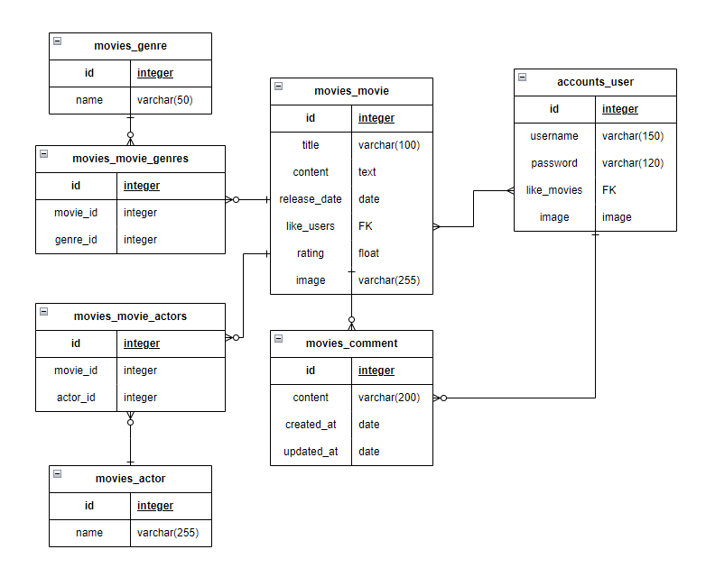

# 🔎 ZnMovie (2023.11.16 ~ 2023.11.24)
    Zoom in Movie
 

 

 

# 1. 팀원 정보 및 업무 분담 내역
 

## 1 - 1. 차현철 (팀장)

    - movies 
  
    - 영화 추천 알고리즘

 

## 1 - 2. 이지은 (팀원)

    - accounts

    - 영화 추천 알고리즘

  

 
 
 

# 2. 목표 서비스 구현 및 실제 구현 정도 
 

## 2 - 1. 목표 서비스

### 1. 영화 추천 서비스

    1) 사용자의 좋아요 기반 같은 장르 추천
    2) 인기도와 평점 순 영화 추천

### 2. 영화 상세 조회

    1) Youtube 관련 영상 재생
    2) 좋아요 및 댓글 기능

### 3. 영화 댓글
   
    1) 각 영화마다 댓글 생성, 조회, 수정, 삭제 가능

### 4. 로그인 상태에 따른 페이지 접근 권한 제한

 

## 2 - 2. 실제 구현 정도

### 1. 영화 추천 서비스

    1) 사용자가 좋아요를 누른 경우 : 사용자의 좋아요 기반 같은 장르 추천
    2) 사용자가 좋아요를 누르지 않은 경우 : 인기도 순, 평점 순 영화 추천

### 2. 영화 상세 조회

    1) Youtube 공식 예고편 재생
    2) 영화 정보 조회 가능
    3) 좋아요 버튼
    4) 댓글 작성, 조회, 수정, 삭제 가능
	
### 3. 영화 댓글

    1) 각 영화의 상세 페이지에서 댓글 작성, 조회, 수정, 삭제 가능
      >> 댓글 수정, 삭제는 작성자만 가능

### 4. 로그인 상태에 따른 페이지 접근 권한 제한
    
    1) 로그아웃 상태 : 회원가입, 로그인, 메인 페이지 제외 접근 불가
    2) 로그인 상태 : 회원가입 페이지 제외 모든 페이지 접근 가능

 
 
 

# 3. 데이터베이스 모델링 (ERD)
 
 

 

# 4. 영화 추천 알고리즘

    1) 사용자가 좋아요를 누른 경우
      좋아요를 누른 영화의 장르를 기반으로 같은 장르의 영화 추천
      - 이미 선택한 장르라면 
        >> 가중치를 더해서 정렬한 후 상위 3개의 장르를 추출해서 영화를 추천
    
    2) 사용자가 좋아요를 누르지 않은 경우
      - 가장 높은 평점을 받은 상위 30개의 영화를 추천
      - 가장 인기있는 상위 30개의 영화를 추천

 
 
 

# 5. 기능 설명
 

| 기능               | 기능 설명                                                               |
| ---------------- | ------------------------------------------------------------------- |
| 회원가입, 로그인        | Dj-Rest-Auth 라이브러리의 authtoken을 사용한 인증, 해당 페이지에 인기도 상위 5개 영화의 배경 랜덤 노출                                          |
| 로그아웃             | authtoken 삭제                                                  |
| 사용자 접근 권한            | 로그인 상태에 따른 페이지 접근 제한                                           |
| nav bar             | 원하는 페이지로 이동 가능                                                   |
| 메인 화면             | 인기도 상위 5개 영화의 배경에 제목과 명대사 노출로 사용자의 흥미를 이끌어냄, 인기도 순 상위 30개의 영화 추천                   |
|나만의 영화 추천     | 사용자의 좋아요를 기반으로 같은 장르의 영화 추천
| 카테고리      | nav bar의 드롭다운에서 원하는 장르를 선택하면 해당 장르의 영화를 모아서 제공
| 영화 상세 페이지     | Youtube 공식 예고편, 줄거리, 장르, 좋아요, 댓글 제공                            |
| 좋아요           | 해당 영화의  좋아요 추가 및 삭제 정보를 데이터베이스에 저장 >> 사용자 맞춤 영화 추천에 사용
| 영화 댓글       | 영화 상세 페이지에서 해당 영화에 대한 댓글 조회, 작성, 수정, 삭제 가능 >> 댓글 수정, 삭제는 작성자만 가능
|

 
 
 

# 6. 느낀 점
 

## 6 - 1. 차현철

    여기에 작성하세요.

 
 

## 6 - 2. 이지은

    웹 사이트 하나를 온전하게 만들어 본 건 처음이었다. 
    한 학기 동안 배웠던 모든 것을 총동원해야 하는 작업들이 절대 쉽지 않았다. 
    하나하나 해 나아가야 할 때마다 수업자료를 찾아보고 실습자료를 들여다보면서 비로소 이해하게 된 것들이 많았다. 
    가장 어려웠던 건 django와 vue의 데이터를 연결하는 것이었는데, 도대체 어디서 어떻게 연결해서 
    정보를 불러오고 내보내야 하는지 알 수 없어서 상당히 힘들었다.
    하지만 원하는 기능을 마침내 구현해냈을 때 느낀 기쁨이 다음으로 넘어갈 수 있는 힘을 줬고, 프로젝트를 완성할 수 있게 했다. 
    이번 프로젝트는 어렵기도 했지만, 흥미롭기도 했다.
    많은 것들을 가능하게 만들어 준 팀장에게 고마움을 전한다.